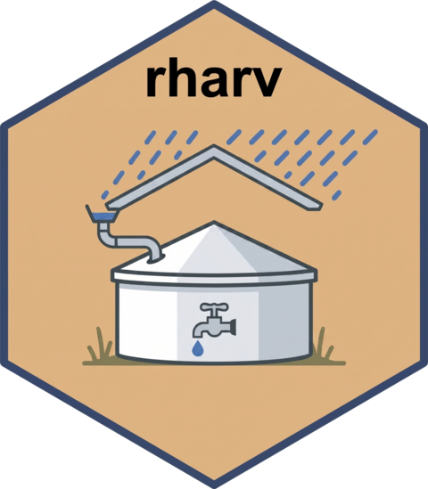

<!-- README.md is generated from README.Rmd. Please edit that file -->

```{r, include = FALSE}
knitr::opts_chunk$set(
  collapse = TRUE,
  comment = "#>",
  fig.path = "man/figures/README-",
  out.width = "100%"
)
```

# rharv 

<!-- badges: start -->
[](https://github.com/ArturLourenco/rharv/actions/workflows/R-CMD-check.yaml)
[](https://lifecycle.r-lib.org/articles/stages.html#experimental)
<!-- badges: end -->

English | [Português (pt-BR)](https://github.com/ArturLourenco/rharv/blob/main/README.pt-BR.md)

rharv simulates rainwater harvesting systems with a daily water-balance model.
From a daily rainfall series it computes the captured volume, runs the reservoir
mass balance day by day, and derives performance metrics (overflow, deficit,
attendance, reliability) and guarantee-based sizing values, that is, the constant
demand, catchment area or reservoir capacity that avoid any shortfall. Reservoir
sizing is left to the analyst: the daily simulation lets you explore many design
values rather than apply a single closed-form rule.

## Installation

```r
# install.packages("remotes")
remotes::install_github("ArturLourenco/rharv")
```

The core (simulation, metrics, sizing) has no heavy dependencies, needing only
base R plus `rlang`. Plotting needs ggplot2 and the app needs shiny and bslib,
all suggested rather than required.

## Quick start

```{r quickstart}
library(rharv)

# Daily demand of a 1089-person campus at 6.03 L/person/day
demand <- rh_daily_demand(1089, 6.03)

# Simulate a 400 m3 reservoir on the bundled Princesa Isabel rainfall series
sim <- rh_simulate(
  precip = precip_pi$value,
  demand = demand,
  area = sum(areas_pi$area_m2),
  capacity = 400,
  runoff = 0.85, efficiency = 1
)
sim

# Largest demand that guarantees zero deficit (m3/day)
rh_guaranteed_demand(precip_pi$value, area = sum(areas_pi$area_m2),
                     capacity = 400, runoff = 0.85, efficiency = 1)
```

## What it does

`rh_simulate()` runs the daily reservoir water balance (YBS or YAS operating
rule) and returns an `rharv_sim` object with `print()`, `summary()` and
`autoplot()` methods; `rh_available_volume()` implements `Vdisp = P * A * C * eta`.
`rh_metrics()` reports overflow, deficit, usable volume, volumetric attendance
and time-based reliability.

Sizing covers the zero-deficit case with `rh_guaranteed_demand()`,
`rh_guaranteed_capacity()` and `rh_required_area()`, and any target guarantee
level with `rh_size_for()`; the solvers are bisection, `stats::optimize` and
incremental search.

For analysis there are parameter sweeps, `rh_sweep()` and `rh_grid()`, with a
fast day-of-year climatology mode, plus `rh_guarantee_curve()`,
`rh_iso_curve()`, `rh_resource_curve()`, `rh_series_spread()`,
`rh_seasonal_demand()`, `rh_scenarios_from_years()` and `rh_compare()`.

The plots include the trade-off surface with iso-guarantee contours
(`rh_plot_tradeoff()`), the lever comparison (`rh_plot_levers()`),
Storage-Yield-Reliability curves (`rh_plot_syr()`), the dimensionless design
curve (`rh_plot_design_curve()`), the iso-guarantee and resource-versus-guarantee
design charts (`rh_plot_iso()`, `rh_plot_resource_curve()`), reservoir
behaviour, monthly balance, failure calendar, rainfall spread and the
climatology heatmap. `rh_explore()` launches a Shiny explorer and `rh_demo()`
opens the annotated demo notebook.

See `vignette("ifpb-pi-case-study")` for a worked example applied to a real
campus and `vignette("analysis-and-sizing")` for the analysis tool-kit.

## References

The daily-simulation approach was applied to this campus in the following
conference paper, before the package's release:

- Silva, R. M. V. da; Lourenço, A. M. G.; Del Grande, M. H.; Farias, C. A. S. de;
  Albuquerque, E. M. de; Araújo, A. O. de (2024). *Avaliação do potencial de
  aproveitamento de água de chuva usando técnicas de modelagem hidrológica:
  estudo de caso do campus IFPB-PI.* XVII Simpósio de Recursos Hídricos do
  Nordeste (XVII SRHNE), João Pessoa-PB. ABRHidro.
  \[[paper](https://github.com/ArturLourenco/rharv/blob/main/paper/XVII-SRHNE-2024-rainwater-harvesting-IFPB-PI.pdf)\]
  \[[slides](https://github.com/ArturLourenco/rharv/blob/main/paper/XVII-SRHNE-2024-presentation.pdf)\]

Background:

- Souza, T. J. (2015). *Potencial de aproveitamento de água de chuva no meio
  urbano: o caso de Campina Grande, PB.* UFCG.
- ABNT NBR 15527:2019, *Aproveitamento de água de chuva de coberturas para
  fins não potáveis* (available-volume relation and efficiency factor;
  supersedes the 2007 edition and leaves reservoir sizing to the designer).

To cite rharv, run `citation("rharv")`. A dedicated software paper is in
preparation (2026).
