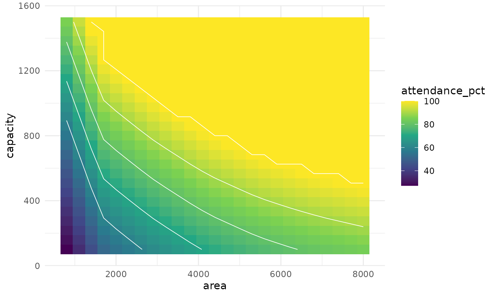
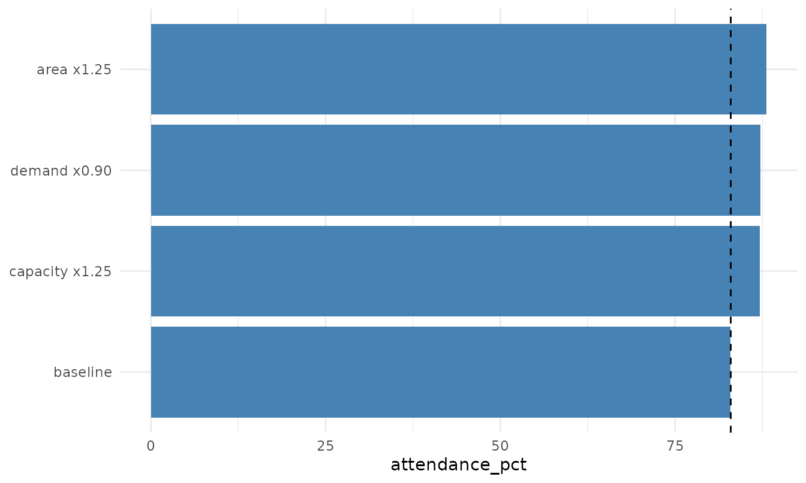
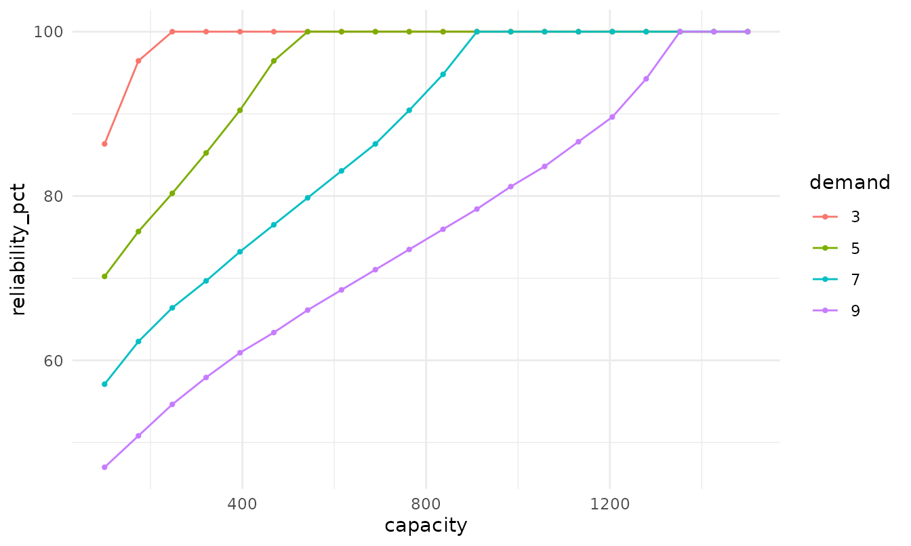
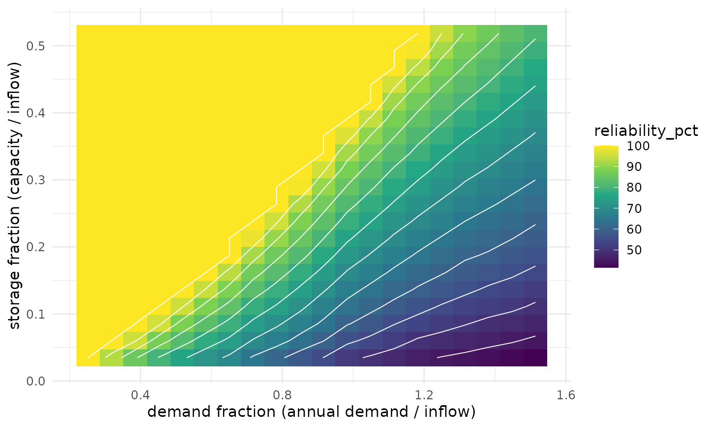
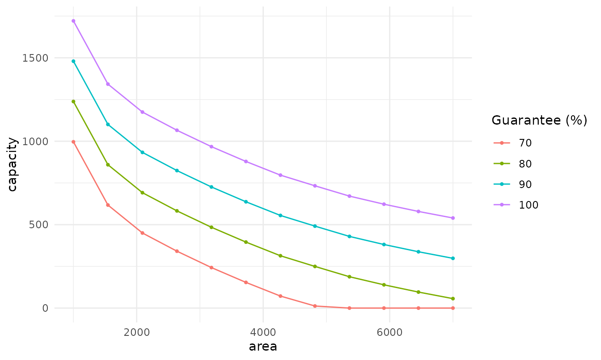
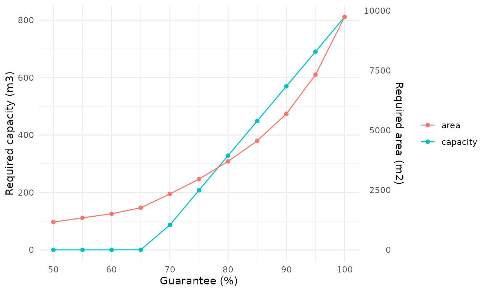
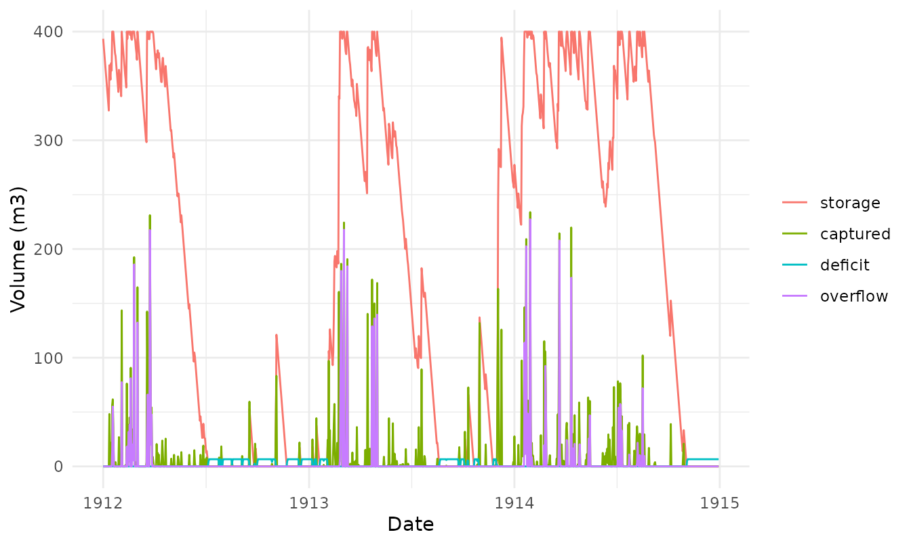
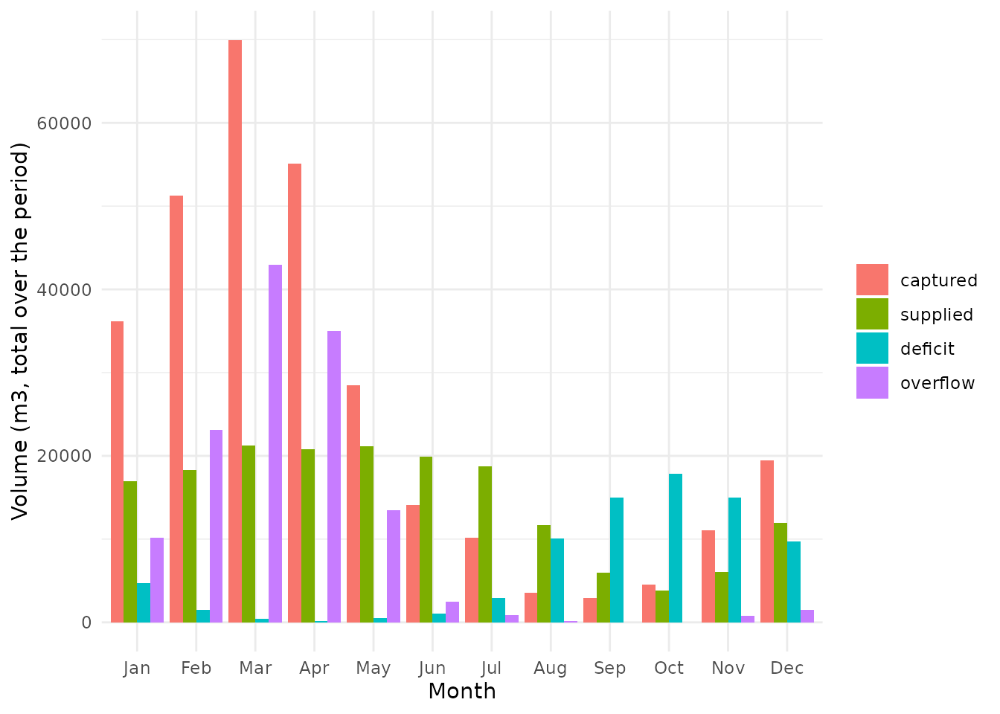
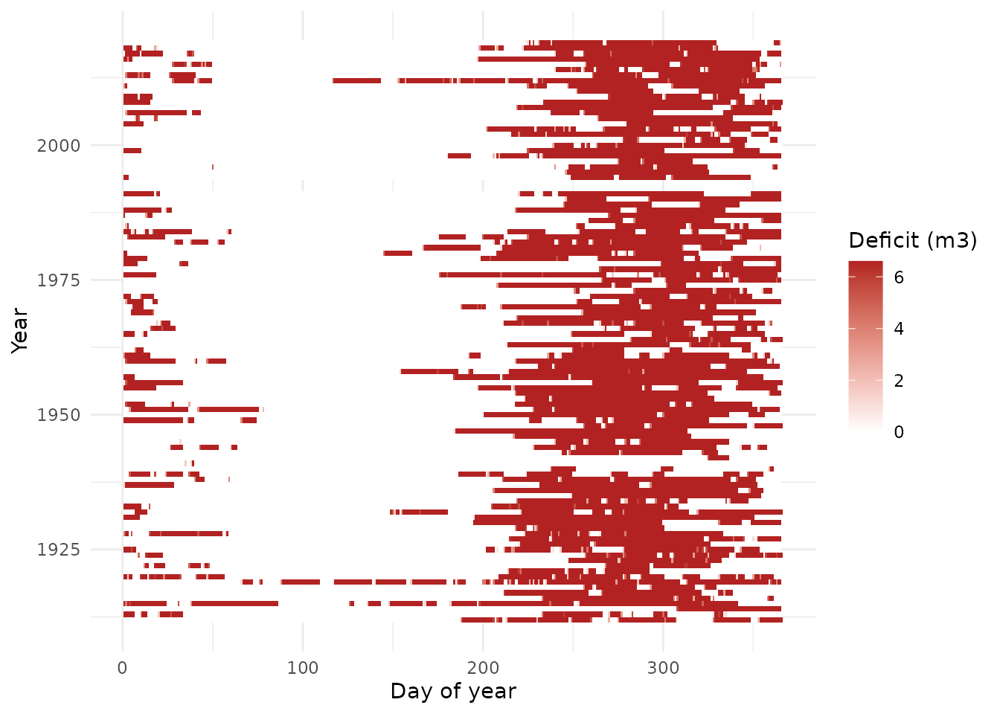
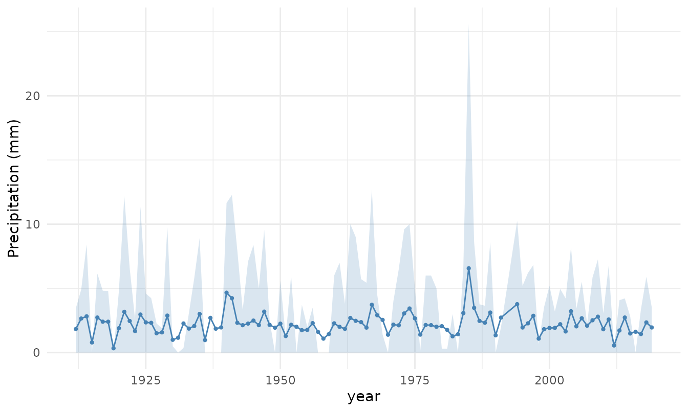

# Analysis and sizing: trade-offs, curves and diagnostics

``` r

library(rharv)
p <- precip_pi$value
d <- precip_pi$date
```

The daily simulation
([`rh_simulate()`](https://arturlourenco.github.io/rharv/reference/rh_simulate.md))
is the engine; the functions below sweep its parameters to build
decision tools. Two reliability metrics are available throughout and are
interchangeable via the `metric` argument: `"attendance_pct"`
(volumetric: share of demand volume met) and `"reliability_pct"`
(temporal: share of days without a shortfall).

> Two-parameter grids run hundreds of simulations. For interactive
> exploration use `climatology = TRUE`, which simulates on the
> day-of-year mean (about 70x faster); confirm final numbers on the full
> series.

## Roof, tank or demand: comparing the levers

[`rh_grid()`](https://arturlourenco.github.io/rharv/reference/rh_grid.md)
sweeps two levers;
[`rh_plot_tradeoff()`](https://arturlourenco.github.io/rharv/reference/rh_plot_tradeoff.md)
draws the resulting surface with iso-performance contours. Here, area vs
capacity at a fixed demand:

``` r

g <- rh_grid(
  p, base = list(demand = 6.6, runoff = 0.85, efficiency = 1),
  x = "area", x_values = seq(800, 8000, length.out = 25),
  y = "capacity", y_values = seq(100, 1500, length.out = 25),
  metrics = "attendance_pct", dates = d, climatology = TRUE
)
rh_plot_tradeoff(g, breaks = c(60, 70, 80, 90, 100))
```



Reading across the contours shows whether enlarging the roof (move
right) or the tank (move up) reaches a target guarantee with less
change.

From a single operating point,
[`rh_plot_levers()`](https://arturlourenco.github.io/rharv/reference/rh_plot_levers.md)
compares the gain from each lever applied alone (here +25% area, +25%
capacity, -10% demand):

``` r

rh_plot_levers(
  p, base = list(demand = 6.6, area = 4170, capacity = 400,
                 runoff = 0.85, efficiency = 1),
  dates = d, climatology = TRUE
)
```



## Storage-Yield-Reliability and the guarantee frontier

Reliability against capacity, one line per demand (the classic SYR
view):

``` r

gs <- rh_grid(
  p, base = list(area = 4170, runoff = 0.85, efficiency = 1),
  x = "capacity", x_values = seq(100, 1500, length.out = 20),
  y = "demand", y_values = c(3, 5, 7, 9),
  metrics = "reliability_pct", dates = d, climatology = TRUE
)
rh_plot_syr(gs)
```



The zero-deficit frontier (guaranteed demand for each capacity):

``` r

rh_guarantee_curve(
  p, base = list(area = 4170, runoff = 0.85, efficiency = 1),
  vary = "capacity", values = seq(100, 1000, by = 150), target = "demand",
  dates = d, climatology = TRUE
)
#>   capacity   demand
#> 1      100 2.150582
#> 2      250 3.434588
#> 3      400 4.422881
#> 4      550 5.277596
#> 5      700 6.049458
#> 6      850 6.779706
#> 7     1000 7.459210
```

A non-dimensional design curve (transferable across sites): demand and
capacity are divided by the mean annual inflow.

``` r

n_years <- length(unique(format(d, "%Y")))
inflow <- sum(rh_available_volume(p, area = 4170, runoff = 0.85, efficiency = 1)) / n_years
gd <- rh_grid(
  p, base = list(area = 4170, runoff = 0.85, efficiency = 1),
  x = "demand", x_values = seq(2, 12, length.out = 20),
  y = "capacity", y_values = seq(100, 1500, length.out = 20),
  metrics = "reliability_pct", dates = d, climatology = TRUE
)
rh_plot_design_curve(gd, annual_inflow = inflow)
```



## Design curves: the stage-area-volume analogue

Iso-guarantee curves relate two levers at fixed guarantee levels (here
area vs the reservoir capacity needed, at fixed demand): along each line
you trade roof for tank without changing the guarantee.

``` r

iso <- rh_iso_curve(
  p, base = list(demand = 6.6, runoff = 0.85, efficiency = 1),
  x = "area", x_values = seq(1000, 7000, length.out = 12),
  y = "capacity", levels = c(70, 80, 90, 100),
  dates = d, climatology = TRUE
)
rh_plot_iso(iso)
```



The closest analogue to the reservoir stage-area-volume curve puts the
guarantee on the x-axis, with the required capacity and area on a dual
y-axis.

``` r

rc <- rh_resource_curve(
  p, base = list(demand = 6.6, area = 4170, capacity = 400,
                 runoff = 0.85, efficiency = 1),
  levels = seq(50, 100, by = 5), dates = d, climatology = TRUE
)
rh_plot_resource_curve(rc)
```



## Diagnostics

``` r

sim <- rh_simulate(p, demand = 6.6, area = 4170, capacity = 400,
                   runoff = 0.85, efficiency = 1)
```

Reservoir behaviour over the first three years:

``` r

n <- 3 * 365
sim3 <- rh_simulate(p[seq_len(n)], demand = 6.6, area = 4170, capacity = 400,
                    runoff = 0.85, efficiency = 1)
rh_plot_behaviour(sim3, dates = d[seq_len(n)])
```



Monthly water balance and the failure calendar (when shortfalls happen):

``` r

rh_plot_monthly_balance(sim, dates = d)
```



``` r

rh_plot_failure_calendar(sim, dates = d)
```



## Rainfall variability and scenarios

The spread of annual rainfall (mean with 10th-90th percentile band):

``` r

rh_plot_spread(rh_series_spread(precip_pi, by = "year"))
```



Stress test by ordering the years dry-to-wet, and compare to the
chronological series:

``` r

dry_first <- rh_scenarios_from_years(precip_pi, order = "increasing")
sim_stress <- rh_simulate(dry_first$value, demand = 6.6, area = 4170,
                          capacity = 400, runoff = 0.85, efficiency = 1)
rh_compare(list(chronological = sim, dry_to_wet = sim_stress))[
  , c("name", "attendance_pct", "reliability_pct", "deficit_total")]
#>            name attendance_pct reliability_pct deficit_total
#> 1 chronological       69.08957        68.34125      78984.07
#> 2    dry_to_wet       69.02962        68.25085      79137.25
```

## Interactive exploration

For an interactive version of all of this, launch the Shiny app:

``` r

rh_explore()
```
