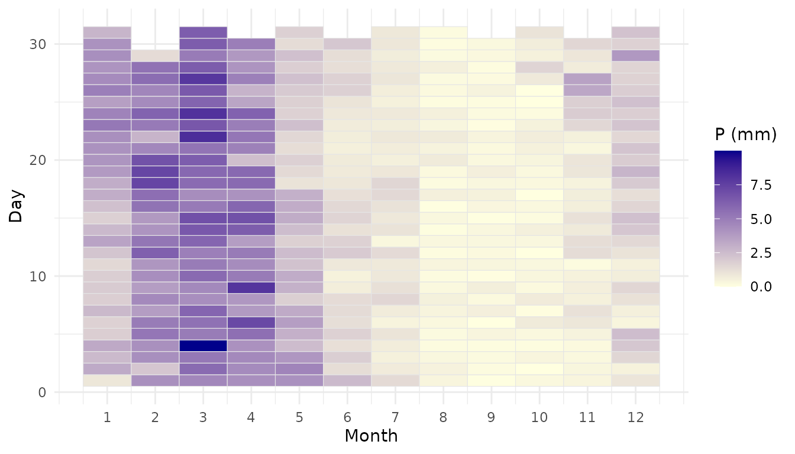
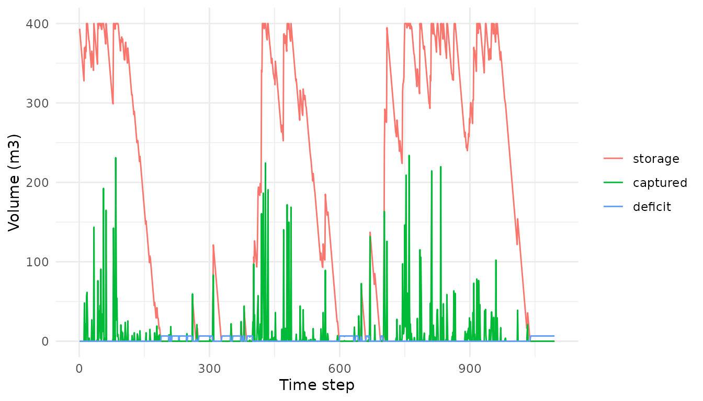

# Worked example: rainwater harvesting at IFPB-PI

``` r

library(rharv)
```

## Overview

This vignette walks through a complete rainwater-harvesting analysis
with `rharv`, applied to the Federal Institute of Paraíba, Campus
Princesa Isabel (IFPB-PI), a campus in the Brazilian semi-arid region.
It shows how to go from a daily rainfall series to system metrics and
design figures using the package’s generic functions. Anything specific
to this application (the campus parameters and the scenarios) is defined
in this vignette rather than shipped with the package.

The analysis uses a daily water-balance model: the captured volume
(`Vdisp = P * A * C * eta`) feeds the reservoir mass balance, simulated
day by day. In this application the runoff coefficient and the system
efficiency are taken together as a single `C = 0.85` (`runoff = 0.85`,
`efficiency = 1`). Volumes are in cubic metres (m³) and the reservoir
starts full (`initial = capacity`). The daily-simulation approach and
the available-volume relation follow established references (Souza,
2015; ABNT NBR 15527).

## Data

`rharv` ships the cleaned daily precipitation series of the Princesa
Isabel gauge (`precip_pi`) and the campus roof areas (`areas_pi`).

``` r

str(precip_pi)
#> 'data.frame':    38716 obs. of  2 variables:
#>  $ date : Date, format: "1912-01-01" "1912-01-02" ...
#>  $ value: num  0 0 0 0 0 0 0 0 0 0 ...
areas_pi
#>            block   area_m2
#> 1      Acadêmico 1509.4008
#> 2 Administrativo 1161.4282
#> 3     Biblioteca  775.5286
#> 4     Refeitório  723.7396
area_total <- sum(areas_pi$area_m2)   # total catchment area (m2)
area_total
#> [1] 4170.097
```

Day-of-year precipitation climatology (the “precipitation matrix”):

``` r

rh_plot_climatology(precip_pi)
```



## Demand

The campus serves 1089 people at about 6.03 L/person/day:

``` r

demand <- rh_daily_demand(population = 1089, per_capita_l = 6.03)  # m3/day
demand
#> [1] 6.56667
```

## Scenarios

We compare two precipitation scenarios, built by sub-setting the series:

- C1 is the full historical series (1912 to 2019).
- C2 is the last ~30 years (from 1989), a drier, more pessimistic
  window.

``` r

year <- as.integer(format(precip_pi$date, "%Y"))
p_c1 <- precip_pi$value
p_c2 <- precip_pi$value[year >= 1989]

sim_c1 <- rh_simulate(p_c1, demand = demand, area = area_total, capacity = 400,
                      runoff = 0.85, efficiency = 1, initial = 400)
sim_c2 <- rh_simulate(p_c2, demand = demand, area = area_total, capacity = 400,
                      runoff = 0.85, efficiency = 1, initial = 400)

sim_c1
#> <rharv_sim>
#>   steps: 38716 | area: 4170.097 m2 | capacity: 400 m3 | timing: after_demand
#>   attendance: 69.3% | reliability: 68.5% | days unmet: 12199
#>   totals (m3): deficit 78150.18 | overflow 130953.28 | usable 175685.02
```

## Annual results

Dividing the totals by the number of years gives the average annual
performance of the system under each scenario:

``` r

n_years_c1 <- length(unique(year))
n_years_c2 <- length(unique(year[year >= 1989]))

results <- data.frame(
  Variable = c("Overflow (m3/yr)", "Deficit (m3/yr)",
               "Usable volume (m3/yr)", "Attendance (%)"),
  C1 = c(sim_c1$summary$overflow_total / n_years_c1,
         sim_c1$summary$deficit_total / n_years_c1,
         sim_c1$summary$usable_volume / n_years_c1,
         sim_c1$summary$attendance_pct),
  C2 = c(sim_c2$summary$overflow_total / n_years_c2,
         sim_c2$summary$deficit_total / n_years_c2,
         sim_c2$summary$usable_volume / n_years_c2,
         sim_c2$summary$attendance_pct)
)
print(results, digits = 5, row.names = FALSE)
#>               Variable       C1      C2
#>       Overflow (m3/yr) 1235.408 1103.59
#>        Deficit (m3/yr)  737.266  708.67
#>  Usable volume (m3/yr) 1657.406 1675.73
#>         Attendance (%)   69.261   70.45
```

With the current 400 m³ reservoir, about 70% of the demand is met in
both scenarios, and the large overflow points to the catchment as the
bottleneck.

## Guarantee-based sizing

The *guaranteed demand* is the largest constant demand met with no
deficit; the *guaranteed capacity* is the smallest reservoir giving no
deficit at the current demand.

``` r

dgar_c1 <- rh_guaranteed_demand(p_c1, area = area_total, capacity = 400,
                                runoff = 0.85, efficiency = 1, initial = 400)
sgar_c1 <- rh_guaranteed_capacity(p_c1, demand = demand, area = area_total,
                                  runoff = 0.85, efficiency = 1)

c(guaranteed_demand_L_day = dgar_c1 * 1000,
  guaranteed_capacity_L   = sgar_c1 * 1000)
#> guaranteed_demand_L_day   guaranteed_capacity_L 
#>                1883.887             3218368.611
```

The guaranteed demand is about 1900 L/day (~29% of the campus demand),
while guaranteeing the full demand with the current catchment would
require a reservoir of several million litres. Both point to expanding
the catchment area as the main lever for water security on this campus.

## Reservoir behaviour

``` r

# first three years, to see the reservoir dynamics
sim_zoom <- rh_simulate(p_c1[1:(3 * 365)], demand = demand, area = area_total,
                        capacity = 400, runoff = 0.85, efficiency = 1, initial = 400)
ggplot2::autoplot(sim_zoom)
```



## Per-block usable volume

The usable volume scales with catchment area, so which roofs are
connected matters for planning:

``` r

per_block <- data.frame(
  block = areas_pi$block,
  usable_m3_yr = vapply(areas_pi$area_m2, function(a) {
    s <- rh_simulate(p_c1, demand = demand, area = a, capacity = 400,
                     runoff = 0.85, efficiency = 1, initial = 400)
    s$summary$usable_volume / n_years_c1
  }, numeric(1))
)
per_block
#>            block usable_m3_yr
#> 1      Acadêmico    1003.1946
#> 2 Administrativo     797.0982
#> 3     Biblioteca     537.2160
#> 4     Refeitório     501.9618
```

## Reference

The IFPB-PI campus was studied in: Silva, R. M. V. da; Lourenço, A. M.
G.; Del Grande, M. H.; Farias, C. A. S. de; Albuquerque, E. M. de;
Araújo, A. O. de (2024). *Avaliação do potencial de aproveitamento de
água de chuva usando técnicas de modelagem hidrológica: estudo de caso
do campus IFPB-PI.* XVII Simpósio de Recursos Hídricos do Nordeste, João
Pessoa-PB. ABRHidro.
